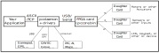
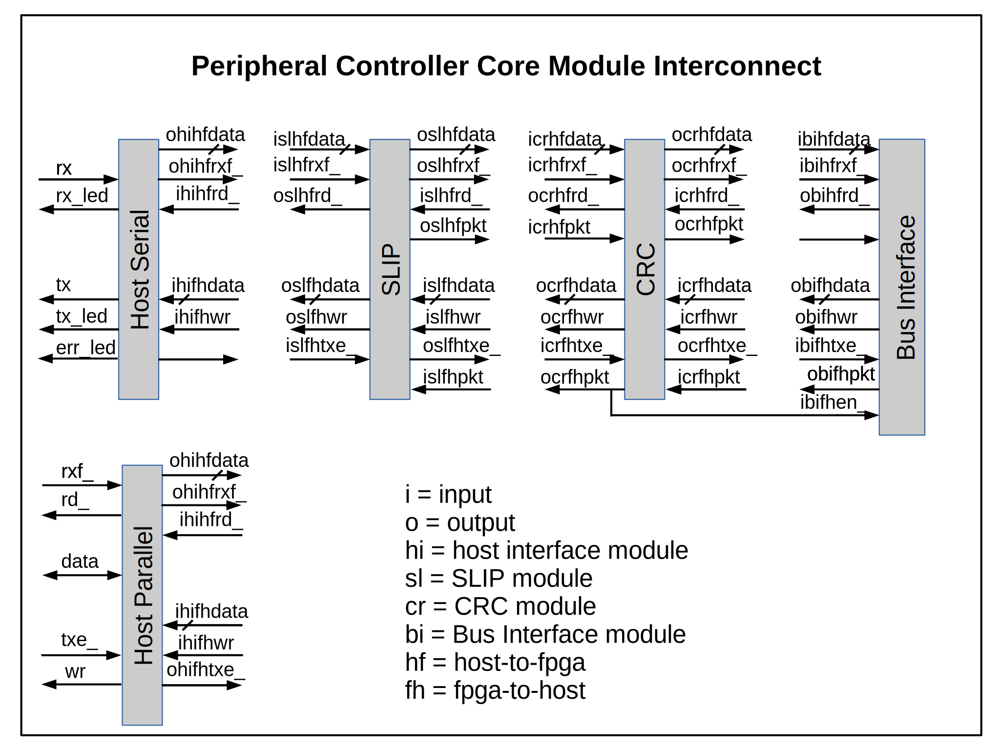

# Protocol Reference Manual
## Introduction

Peripheral Control is a FPGA-based robot or automation controller
that uses an FPGA for logic, timing, and I/O pins.  Peripherals are
controlled by a host which communicates with the FPGA board using
a protocol described in this document.

The overall architecture of Peripheral Control is shown in the
following diagram.  Applications on the host communicate with a
daemon that converts the ASCII text commands of the API into
control packets that go to the FPGA.

This document describes the packet processing in the FPGA as well
as the low-level protocol between the host and the FPGA,  Briefly: 
  - The protocol is organized as SLIP encoded packets with CRC
  - Each packet contains either a Read or Write command
  - A packet may read or write multiple values
  - A packet may read or write the same register or consecutive registers
  - Registers are 8 bits wide
  - Addresses are 12 bits wide
  - A **slot** is the high 4 bits of the address
  - A response packet indicates success or failure of a command packet
  - Data can be sent automatically from the FPGA to the host

This document is intended to anyone who wants to add a new type
of host interface (such as Ethernet), or anyone who wants to replace
pcdaemon with an application specific daemon (such as ROS or a
gcode interpreter).

## Architecture
The diagram below gives a glimpse into the internal architecture 
of the pccore FPGA logic.  There is an address and data bus and
logic to convert the host packets into bus reads and writes.  The
peripheral in slot #0 always has a list of the peripherals in the
FPGA image.  Slot #0 also has any I/O specific to the FPGA board.
Common FPGA board I/O includes buttons, switches, LEDs, and seven
segment displays.

Packets to and from the host are SLIP encoded and have a 16 bit
CRC checksum.  This diagram shows the FPGA packet processing.  
Note that inputs to one module are assigned to the name of the
previous output.  This assignment is done in the "protomain" file.

There are two types of host interface.  One is simple serial Tx/Rx
with 8 data bits, one stop bit, and one start bit.  Currently 
supported bit rates are 115200, 230400, and 460800.  It is fairly
easy to add more or different bit rates.

The second type of host interface is FTDI parallel.  The host sees
what looks like a serial port but the FPGA sees a bidirectional 8
bit data bus with two handshaking lines in each direction.  USB uses
a half-duplex protocol and can add latency due to its turnaround 
time.  A serial connection directly to the host is sometime faster
than USB.

Serial Line IP encapsulation is used to mark the start and end of
each packet.  This means there should be two consecutive END
characters between packets.  

The CRC generator/checker uses the XMODEM-CRC polynomial.  This
CRC is fairly easy to compute in an FPGA.  The code for the CRC in
the function "crc16" in file crc.v. Buffers in the CRC receiver
hold partial packets until the CRC can be verified.  If the CRC
is valid the packet is given to the bus interface for processing.

 
 

## Packet Format

An overview of the packet format is given in the table below.

<table border=1 cellpadding=2>
<tr><th> Byte             </th><th> Meaning                                   </th></tr>
<tr><td> SLIP End Char    </td><td>                                           </td></tr>
<tr><td> Command Byte     </td><td> Read or Write with/without auto-increment </td></tr>
<tr><td> Slot Number      </td><td> Slot address (1110 xxxx)                  </td></tr>
<tr><td> Register Address </td><td> Start address if auto-increment           </td></tr>
<tr><td> Request Count    </td><td> Number of bytes requested                 </td></tr>
<tr><td> Data             </td><td>                                           </td></tr>
<tr><td> ::::             </td><td>                                           </td></tr>
<tr><td> Data             </td><td>                                           </td></tr>
<tr><td> Transfer Count   </td><td> Only on read response                     </td></tr>
<tr><td> CRC High Byte    </td><td>                                           </td></tr>
<tr><td> CRC Low Byte     </td><td>                                           </td></tr>
<tr><td> SLIP End Char    </td><td>                                           </td></tr>
</table>

The command byte has bits to set the direction of the transfer and
whether the transfer is to a single FIFO register or to consecutive
registers.  Valid values for the command byte are: 
<pre>
    0x04    Read, no autoincrement
    0x06    Read, with autoincrement
    0x08    Write, no autoincrement
    0x0a    Write, with autoincrement
</pre>
Note that read and write are separate bits in the command byte.
While currently unused, this makes possible a combination
read/write command for something such as an SPI transfer.

Bit 7 of the command byte has significance in read response packets
from the FPGA to the host.  If bit 7 is cleared then the packet is
in response to a read request from the host.  Peripherals can send
to the host without a read request from the host.  This is called
**autosend**.  Bit 7 is set in autosend packets so the host can
differentiate between a user initiated read response and an autosend
packet.

The slot number byte specifies which peripheral is being addressed.
Up to 16 peripherals are supported and the first peripheral (#0) is
reserved for the enumerator and FPGA board I/O.  It is a relatively
easy change to allow for more than 16 peripherals.

The register address byte specifies the target 8 bit register in the
peripheral.  When autoincrement is used this address is the start
address of the autoincrement.

The request count byte specified how many bytes to read or how many
bytes to write.  A write packet should always have this many bytes
of data.

Transfer count specifies how many bytes the peripheral was able to
accept on a write or how many bytes were available on a read.
This count is useful when dealing with FIFOs.  On a write
the transfer count tells how many the byte the FIFO was able to
accept.  The host application can examine the transfer count and
move its write buffer pointer to the first byte that was not 
accepted.  A host read of a FIFO register usually requests 255
bytes with the transfer count telling how many bytes were available.

 

